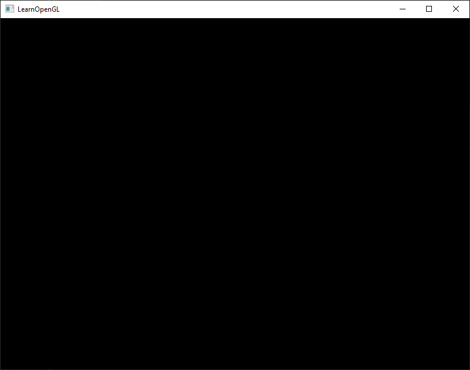
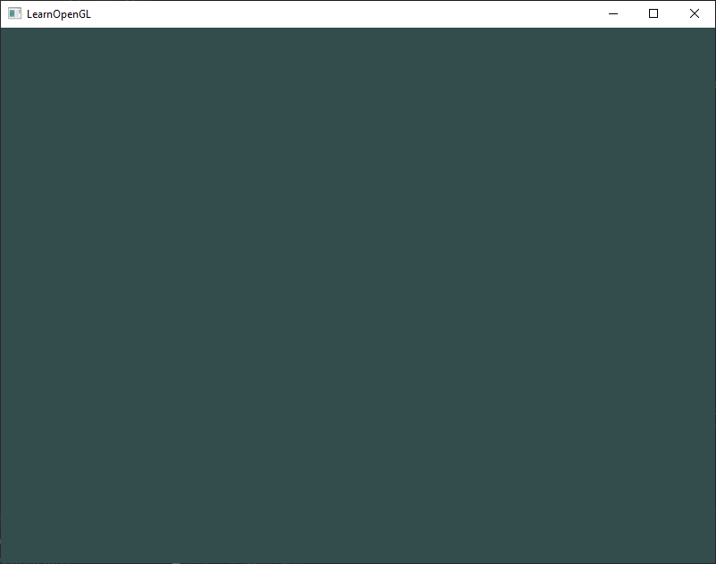

# Hello Window

GLFW를 실행해 보겠습니다. 먼저, .cpp 파일을 생성한 뒤 새로 만든 파일의 맨 위에 다음 헤더를 추가하세요.

```C++
#include <glad/glad.h>
#include <GLFW/glfw3.h>
```

> 반드시 GLAD를 GLFW보다 먼저 포함해야 합니다. GLAD의 포함 파일은 OpenGL 관련 헤더(GL/gl.h 등)를 내부적으로 포함하므로, OpenGL이 필요한 다른 헤더 파일들(예: GLFW)보다 GLAD를 먼저 포함해야 합니다.

이제, GLFW 윈도우를 생성할 메인 함수를 작성해 봅시다.

```C++
int main()
{
    glfwInit();
    glfwWindowHint(GLFW_CONTEXT_VERSION_MAJOR, 3);
    glfwWindowHint(GLFW_CONTEXT_VERSION_MINOR, 3);
    glfwWindowHint(GLFW_OPENGL_PROFILE, GLFW_OPENGL_CORE_PROFILE);
    //glfwWindowHint(GLFW_OPENGL_FORWARD_COMPAT, GL_TRUE);
  
    return 0;
}
```

메인 함수에서 먼저 `glfwInit`을 사용해 GLFW를 초기화합니다. 이후 `glfwWindowHint`를 사용해 GLFW를 설정할 수 있습니다. `glfwWindowHint`의 첫 번째 인자는 설정하고자 하는 옵션을 지정하며, 해당 옵션은 GLFW_로 시작하는 다양한 열거형(enum) 중에서 선택할 수 있습니다. 두 번째 인자는 옵션의 값을 설정하는 정수입니다. 사용 가능한 옵션과 그 값의 목록은 [GLFW의 윈도우 핸들링 문서](https://www.glfw.org/docs/latest/window.html#window_hints)에서 확인할 수 있습니다. 만약 애플리케이션 실행 시 정의되지 않은 참조(undefined reference) 오류가 많이 발생한다면, GLFW 라이브러리를 제대로 링크하지 못한 것입니다.

이 책의 초점은 OpenGL 3.3 버전에 맞추고 있으므로, GLFW에 우리가 사용할 OpenGL 버전이 3.3임을 명시해야 합니다. 이를 통해 GLFW는 OpenGL 컨텍스트를 생성할 때 적절히 설정할 수 있습니다. 사용자 시스템에서 올바른 OpenGL 버전을 지원하지 않을 경우, GLFW는 실행되지 않습니다. 이를 위해 OpenGL의 주 버전(major)과 부 버전(minor)을 모두 3으로 설정하고, core-profile을 명시적으로 사용하도록 지시합니다. core-profile을 사용한다는 것은 이전 버전의 호환 기능을 제거하고 더 작은 OpenGL 기능 집합만 접근한다는 의미입니다. 참고로 Mac OS X에서는 `glfwWindowHint(GLFW_OPENGL_FORWARD_COMPAT, GL_TRUE);`를 초기화 코드에 추가해야 정상적으로 작동합니다.

> 시스템/하드웨어에 OpenGL 3.3 이상이 설치되어 있는지 반드시 확인하세요. 그렇지 않으면 애플리케이션이 충돌하거나 정의되지 않은 동작을 보일 수 있습니다. Linux에서는 glxinfo 명령을 호출하거나, Windows에서는 OpenGL Extension Viewer와 같은 유틸리티를 사용해 OpenGL 버전을 확인할 수 있습니다. 지원 버전이 낮다면 그래픽 카드가 OpenGL 3.3 이상을 지원하는지 확인하고(지원하지 않는다면 매우 오래된 카드일 가능성이 큽니다), 드라이버를 업데이트해 보세요.

다음으로, 윈도우 객체를 생성해야 합니다. 이 윈도우 객체는 모든 윈도우 데이터(windowing data)를 보유하며, GLFW의 대부분의 다른 함수에서 필요합니다.

```C++
GLFWwindow* window = glfwCreateWindow(800, 600, "LearnOpenGL", NULL, NULL);
if (window == NULL)
{
    std::cout << "Failed to create GLFW window" << std::endl;
    glfwTerminate();
    return -1;
}
glfwMakeContextCurrent(window);
```

`glfwCreateWindow` 함수는 첫 번째와 두 번째 인자로 각각 윈도우의 너비와 높이를 요구합니다. 세 번째 인자는 윈도우의 이름을 설정하는 데 사용됩니다. 여기서는 "LearnOpenGL"로 설정했지만, 원하는 이름으로 변경 가능합니다. 마지막 두 인자는 무시할 수 있습니다. 이 함수는 나중에 다른 GLFW 작업에 필요할 `GLFWwindow` 객체를 반환합니다. 그런 다음, GLFW에게 생성한 윈도우의 컨텍스트를 현재 스레드의 주 컨텍스트로 설정하도록 지시합니다.

## GLAD

이전 장에서 GLAD가 OpenGL 함수 포인터를 관리한다고 언급했으므로, OpenGL 함수를 호출하기 전에 GLAD를 초기화해야 합니다.

```C++
if (!gladLoadGLLoader((GLADloadproc)glfwGetProcAddress))
{
    std::cout << "Failed to initialize GLAD" << std::endl;
    return -1;
}    
```

GLAD에 OpenGL 함수 포인터의 주소를 로드하는 함수를 전달해야 하는데, 이는 운영 체제별로 다릅니다. GLFW는 우리가 컴파일하는 운영 체제에 맞는 적절한 함수를 정의하는 `glfwGetProcAddress`를 제공합니다.

## Viewport

렌더링을 시작하기 전에 한 가지 작업을 더 해야 합니다. OpenGL에 렌더링 윈도우의 크기를 알려야 데이터와 좌표를 윈도우에 어떻게 표시할지 알 수 있습니다. 이 크기는 `glViewport` 함수를 통해 설정할 수 있습니다.

```C++
glViewport(0, 0, 800, 600);
```

`glViewport` 함수의 첫 번째와 두 번째 인자는 윈도우의 좌측 하단 코너 위치를 설정합니다. 세 번째와 네 번째 인자는 렌더링 윈도우의 너비와 높이를 픽셀 단위로 설정하며, 일반적으로 GLFW의 윈도우 크기와 동일하게 설정합니다.

렌더링 윈도우의 크기를 GLFW의 윈도우 크기보다 작게 설정할 수도 있습니다. 이렇게 하면 OpenGL 렌더링이 더 작은 윈도우에 표시되며, 예를 들어 OpenGL 뷰포트 외부에 다른 요소를 표시할 수도 있습니다.

> OpenGL은 glViewport로 설정한 데이터를 사용해 처리된 2D 좌표를 화면상의 좌표로 변환합니다. 예를 들어, 처리된 점의 좌표가 (-0.5, 0.5)라면 최종 변환으로 화면 좌표 (200, 450)에 매핑될 수 있습니다. OpenGL에서 처리된 좌표는 -1에서 1 사이의 범위에 있으므로, 이 범위를 화면의 가로 (0, 800)와 세로 (0, 600)로 매핑하게 됩니다.

하지만 사용자가 윈도우 크기를 변경하면 뷰포트도 이에 맞게 조정되어야 합니다. 이를 위해, 윈도우가 리사이즈될 때 호출되는 콜백 함수를 등록할 수 있습니다. 이 리사이즈 콜백 함수의 프로토타입은 다음과 같습니다:

```C++
void framebuffer_size_callback(GLFWwindow* window, int width, int height);  
```

프레임버퍼 크기 함수는 첫 번째 인자로 `GLFWwindow` 객체를, 두 번째와 세 번째 인자로 새 윈도우 크기를 나타내는 정수를 받습니다. 윈도우 크기가 변경될 때마다 GLFW는 이 함수를 호출하며, 적절한 인자를 채워 제공해줍니다.

```C++
void framebuffer_size_callback(GLFWwindow* window, int width, int height)
{
    glViewport(0, 0, width, height);
}  
```

GLFW에게 윈도우 크기 변경 시 이 함수를 호출하도록 설정하려면 콜백 함수를 등록해야 합니다:

```C++
glfwSetFramebufferSizeCallback(window, framebuffer_size_callback);  
```

윈도우가 처음 표시될 때도 `framebuffer_size_callback` 함수가 호출되며, 해당 윈도우 크기를 인자로 받습니다. 레티나 디스플레이의 경우, 너비와 높이가 원래 입력 값보다 훨씬 크게 나올 수 있습니다.

GLFW에서는 다양한 콜백 함수를 등록해 사용자 정의 기능을 처리할 수 있습니다. 예를 들어, 조이스틱 입력 변경을 처리하거나 에러 메시지를 처리하는 콜백 함수를 만들 수 있습니다. 이러한 콜백 함수들은 윈도우 생성 후, 렌더 루프를 시작하기 전에 등록합니다.

## Ready your engines

응용 프로그램이 한 번의 이미지만 그린 뒤 즉시 종료하거나 창을 닫는 것을 원하지 않습니다. 우리는 응용 프로그램이 종료 명령을 받을 때까지 계속 이미지를 그리고 사용자 입력을 처리하도록 하고 싶습니다. 이를 위해 렌더 루프라 불리는 while 루프를 생성해야 합니다. 이 루프는 GLFW가 중지를 지시받을 때까지 계속 실행됩니다. 다음 코드는 간단한 렌더 루프를 보여줍니다:

```C++
while(!glfwWindowShouldClose(window))
{
    glfwSwapBuffers(window);
    glfwPollEvents();    
}
```

`glfwWindowShouldClose` 함수는 루프의 각 반복이 시작될 때 GLFW가 닫히도록 지시받았는지 확인합니다. 닫히도록 지시받은 경우 이 함수는 true를 반환하며, 렌더 루프는 실행을 중지하고 응용 프로그램을 종료할 수 있습니다.

`glfwPollEvents` 함수는 키보드 입력이나 마우스 이동 같은 이벤트가 발생했는지 확인하고, 윈도우 상태를 업데이트하며, 등록된 콜백 함수들을 호출합니다.

`glfwSwapBuffers` 함수는 현재 렌더링된 프레임을 출력 화면에 표시하기 위해 색상 버퍼(각 픽셀의 색상 값을 포함하는 큰 2D 버퍼)를 교체합니다.

> 더블 버퍼 (Double buffer)  
응용 프로그램이 단일 버퍼를 사용하여 그릴 경우 결과 이미지에 깜박임 문제가 발생할 수 있습니다. 이는 출력 이미지가 한 순간에 그려지는 것이 아니라 픽셀 단위로 보통 왼쪽에서 오른쪽, 위에서 아래로 그려지기 때문입니다. 이 이미지가 아직 렌더링 중일 때 사용자에게 표시되면 결과물에 아티팩트가 포함될 수 있습니다. 이러한 문제를 해결하기 위해 창 기반 응용 프로그램은 렌더링에 더블 버퍼링을 적용합니다.
프론트 버퍼는 화면에 표시되는 최종 출력 이미지를 포함하며, 모든 렌더링 명령은 백 버퍼에 그려집니다. 렌더링 명령이 모두 완료되면 백 버퍼와 프론트 버퍼를 교체하여, 렌더링 중인 이미지가 표시되지 않도록 하고 앞서 언급된 모든 아티팩트를 제거합니다.

## One last thing

렌더 루프에서 나가면 할당된 GLFW의 모든 리소스를 적절히 정리/삭제해야 합니다. 이는 `glfwTerminate` 함수를 통해 메인 함수의 끝에서 호출하여 수행할 수 있습니다.

```C++
glfwTerminate();
return 0;
```

이 함수는 모든 리소스를 정리하고 응용 프로그램을 올바르게 종료합니다. 이제 응용 프로그램을 컴파일해보세요. 모든 것이 정상적으로 진행되었다면 다음과 같은 출력이 표시될 것입니다:



만약 화면에 매우 밋밋하고 지루한 검은 이미지가 표시된다면, 제대로 진행한 것입니다! 올바른 이미지가 나오지 않거나 모든 과정이 어떻게 연결되는지 혼란스럽다면, [전체 소스 코드](https://learnopengl.com/code_viewer_gh.php?code=src/1.getting_started/1.1.hello_window/hello_window.cpp)에서 확인하세요. (만약 화면이 다른 색상으로 깜빡이기 시작했다면 계속 읽어보세요).

응용 프로그램 컴파일에 문제가 있다면 먼저 모든 링크 옵션이 올바르게 설정되었는지, 그리고 IDE에서 올바른 디렉토리를 포함했는지 확인하세요. (이는 이전 장에서 설명되었습니다.) 또한 코드가 정확한지도 확인해야 합니다. 전체 소스 코드와 비교하여 확인할 수 있습니다.

## Input

GLFW에서 입력 제어를 구현하고자 한다면, GLFW의 여러 입력 함수를 사용할 수 있습니다. 여기서는 `glfwGetKey` 함수를 사용할 것입니다. 이 함수는 윈도우와 키를 입력으로 받아 해당 키가 현재 눌려 있는지를 반환합니다. 입력 코드를 정리하기 위해 `processInput` 함수를 생성합니다:

```C++
void processInput(GLFWwindow *window)
{
    if(glfwGetKey(window, GLFW_KEY_ESCAPE) == GLFW_PRESS)
        glfwSetWindowShouldClose(window, true);
}
```

여기에서는 사용자가 ESC 키를 눌렀는지 확인합니다. (키가 눌리지 않았다면 `glfwGetKey`는 `GLFW_RELEASE`를 반환합니다.) 사용자가 ESC 키를 눌렀다면, `glfwSetWindowShouldClose`를 사용해 윈도우의 WindowShouldClose 속성을 true로 설정하여 GLFW를 닫습니다. 그러면 메인 while 루프의 다음 조건 확인이 실패하여 응용 프로그램이 종료됩니다.

그런 다음 렌더 루프의 각 반복(iteration)에서 `processInput`을 호출합니다:

```C++
while (!glfwWindowShouldClose(window))
{
    processInput(window);

    glfwSwapBuffers(window);
    glfwPollEvents();
}  
```

이를 통해 특정 키 입력을 쉽게 확인하고 매 프레임마다 적절히 반응할 수 있습니다. 렌더 루프의 한 번의 반복은 일반적으로 **프레임(frame)**이라고 부릅니다.

## Rendering

모든 렌더링 명령은 렌더 루프에 배치해야 합니다. 루프의 각 반복 또는 프레임마다 모든 렌더링 명령을 실행하기 때문입니다. 이는 대략 다음과 같은 모습일 것입니다:

```C++
// render loop
while(!glfwWindowShouldClose(window))
{
    // input
    processInput(window);

    // rendering commands here
    ...

    // check and call events and swap the buffers
    glfwPollEvents();
    glfwSwapBuffers(window);
}
```

우리가 원하는 색상으로 화면을 초기화하여 제대로 동작하는지 테스트하고자 합니다. 프레임 시작 시 화면을 초기화해야 합니다. 그렇지 않으면 이전 프레임의 결과가 여전히 보이게 됩니다(이는 원하는 효과일 수도 있지만, 일반적으로 그렇지 않습니다). 화면의 컬러 버퍼를 초기화하려면 `glClear`를 사용하며, 초기화할 버퍼를 지정하기 위해 버퍼 비트(buffer bits)를 전달합니다. 설정 가능한 비트로는 `GL_COLOR_BUFFER_BIT`, `GL_DEPTH_BUFFER_BIT`, `GL_STENCIL_BUFFER_BIT`가 있습니다. 현재는 색상 값만 중요하므로 컬러 버퍼만 초기화합니다.

```C++
glClearColor(0.2f, 0.3f, 0.3f, 1.0f);
glClear(GL_COLOR_BUFFER_BIT);
```

또한, `glClearColor`를 사용하여 화면을 초기화할 색상을 지정합니다. `glClear`를 호출하여 컬러 버퍼를 초기화할 때, 전체 컬러 버퍼는 `glClearColor`로 설정된 색상으로 채워집니다. 결과적으로 어두운 녹청색 화면이 표시됩니다.

> OpenGL 챕터에서 기억하듯이, glClearColor 함수는 상태를 설정하는 함수이고, glClear 함수는 현재 상태를 사용하여 초기화 색상을 가져오는 상태 사용 함수입니다.



응용 프로그램의 전체 소스 코드는 [여기](https://learnopengl.com/code_viewer_gh.php?code=src/1.getting_started/1.2.hello_window_clear/hello_window_clear.cpp)에서 확인할 수 있습니다.

이제 렌더 루프에 많은 렌더링 호출을 추가할 준비가 되었지만, 이는 다음 챕터에서 다룹니다. 여기까지 이야기를 충분히 했다고 생각합니다.