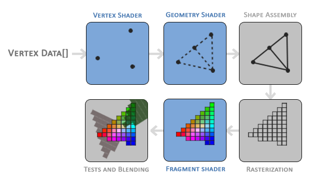
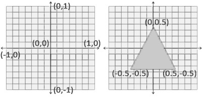
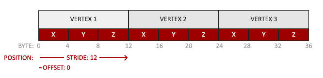
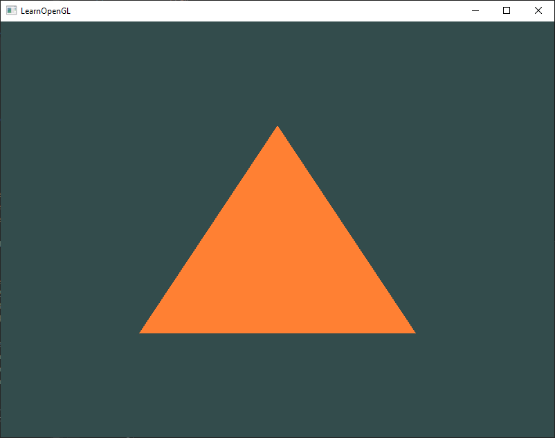
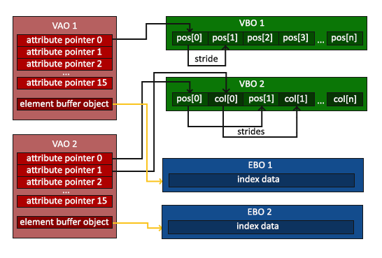
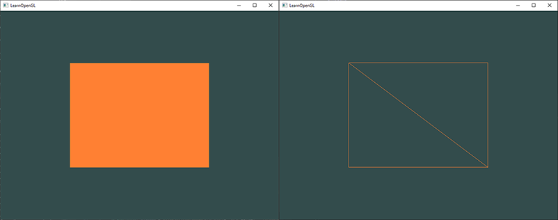

# Hello Triangle

OpenGL에서 모든 것은 3D 공간에서 이루어지지만, 화면이나 창은 2D 픽셀 배열이므로 OpenGL 작업의 큰 부분은 모든 3D 좌표를 화면에 맞는 2D 픽셀로 변환하는 것입니다. 3D 좌표를 2D 픽셀로 변환하는 과정은 OpenGL의 그래픽스 파이프라인에 의해 관리됩니다. 그래픽스 파이프라인은 두 개의 큰 부분으로 나뉩니다. 첫 번째는 3D 좌표를 2D 좌표로 변환하며, 두 번째는 2D 좌표를 실제 색이 입혀진 픽셀로 변환합니다. 이번 챕터에서는 그래픽스 파이프라인을 간단히 살펴보고, 이를 활용해 멋진 픽셀을 생성하는 방법을 알아보겠습니다.

그래픽스 파이프라인은 3D 좌표의 집합을 입력으로 받아 화면에 색칠된 2D 픽셀로 변환합니다. 그래픽스 파이프라인은 여러 단계로 나뉘며, 각 단계는 이전 단계의 출력을 입력으로 사용합니다. 이러한 단계는 모두 매우 전문화되어 있으며(하나의 특정 기능만 수행), 쉽게 병렬로 실행될 수 있습니다. 병렬 특성 덕분에 오늘날의 그래픽스 카드는 수천 개의 작은 처리 코어를 통해 그래픽스 파이프라인 내의 데이터를 빠르게 처리할 수 있습니다. 처리 코어는 파이프라인의 각 단계에서 GPU 상에서 실행되는 작은 프로그램을 구동합니다. 이러한 작은 프로그램을 셰이더(Shader)라고 합니다.

이 셰이더 중 일부는 개발자가 설정할 수 있어 기본 셰이더를 교체할 자신만의 셰이더를 작성할 수 있습니다. 이를 통해 파이프라인의 특정 부분에 대해 훨씬 더 세밀한 제어가 가능하며, 셰이더가 GPU에서 실행되기 때문에 CPU 시간을 절약할 수도 있습니다. 셰이더는 OpenGL 셰이딩 언어(GLSL)로 작성되며, 다음 챕터에서 이에 대해 자세히 다룰 것입니다.

아래는 그래픽스 파이프라인의 모든 단계를 추상적으로 표현한 것입니다. 파란색 섹션은 개발자가 자신의 셰이더를 주입할 수 있는 부분을 나타냅니다.



보시다시피 그래픽스 파이프라인은 정점 데이터를 완전히 렌더링된 픽셀로 변환하는 각 부분을 처리하는 여러 섹션으로 구성되어 있습니다. 파이프라인이 작동하는 방식에 대한 전반적인 이해를 돕기 위해 각 부분을 간단히 설명하겠습니다.

그래픽스 파이프라인의 입력으로 세 개의 3D 좌표로 구성된 삼각형 데이터를 배열 형태로 전달하며, 이를 **정점 데이터(Vertex Data)**라고 합니다. 정점 데이터는 정점들의 모음이며, 정점은 3D 좌표당 데이터 모음입니다. 정점 데이터는 **정점 속성(Vertex Attributes)**으로 표현되며, 이 속성에는 원하는 데이터를 포함할 수 있지만, 간단히 하기 위해 각 정점이 3D 위치와 일부 색상 값으로만 구성된다고 가정합니다.

> OpenGL이 전달받은 좌표와 색상 값의 모음을 어떻게 처리할지 알기 위해, 데이터를 어떤 방식으로 렌더링할지 힌트를 제공해야 합니다. 데이터를 점, 삼각형 또는 긴 선으로 렌더링할지 결정하는 이러한 힌트를 **프리미티브(Primitives)**라고 하며, OpenGL의 그리기 명령을 호출할 때 제공합니다. 주요 프리미티브에는 `GL_POINTS`, `GL_TRIANGLES`, `GL_LINE_STRIP` 등이 있습니다.

파이프라인의 첫 번째 단계는 **정점 셰이더(Vertex Shader)**입니다. 정점 셰이더는 하나의 정점을 입력으로 받아 3D 좌표를 다른 3D 좌표로 변환하는 것이 주된 목적이며(이후에 자세히 설명), 정점 속성에 대한 기본적인 처리를 수행할 수 있습니다.

정점 셰이더 단계의 출력은 선택적으로 **지오메트리 셰이더(Geometry Shader)**에 전달됩니다. 지오메트리 셰이더는 하나의 프리미티브를 형성하는 정점 모음을 입력으로 받아, 새로운 정점을 생성하여 새로운(또는 다른) 프리미티브를 생성할 수 있습니다. 예를 들어, 주어진 모양에서 두 번째 삼각형을 생성할 수 있습니다.

프리미티브 어셈블리(Primitive Assembly) 단계는 정점 셰이더(또는 지오메트리 셰이더)에서 출력된 모든 정점(또는 GL_POINTS를 선택한 경우 정점 하나)을 입력으로 받아 프리미티브 모양으로 모든 점을 조립합니다. 이 예에서는 두 개의 삼각형이 조립됩니다.

프리미티브 어셈블리 단계의 출력은 래스터화(Rasterization) 단계로 전달되며, 이 단계에서 결과 프리미티브를 최종 화면의 픽셀에 매핑하여 **프래그먼트(Fragment)**를 생성합니다. 이 프래그먼트는 **프래그먼트 셰이더(Fragment Shader)**에서 사용됩니다. 프래그먼트 셰이더가 실행되기 전에 **클리핑(Clipping)**이 수행됩니다. 클리핑은 화면 밖에 있는 모든 프래그먼트를 제거하여 성능을 향상시킵니다.

> OpenGL에서 **프래그먼트(Fragment)**는 OpenGL이 단일 픽셀을 렌더링하는 데 필요한 모든 데이터입니다.

**프래그먼트 셰이더(Fragment Shader)**의 주요 목적은 픽셀의 최종 색상을 계산하는 것입니다. 이 단계는 일반적으로 OpenGL의 고급 효과들이 이루어지는 단계입니다. 보통 프래그먼트 셰이더는 최종 픽셀 색상을 계산하기 위해 3D 장면에 대한 데이터(예: 조명, 그림자, 조명의 색상 등)를 사용할 수 있습니다.

모든 해당 색상 값이 계산된 후, 최종 객체는 알파 테스트(Alpha Test) 및 블렌딩(Blending) 단계를 거칩니다. 이 단계는 해당 프래그먼트의 깊이(그리고 스텐실) 값을 확인하여 결과적인 프래그먼트가 다른 객체 앞이나 뒤에 있는지 체크하고 그에 따라 프래그먼트를 폐기합니다. 또한 알파 값(알파 값은 객체의 불투명도를 정의함)을 확인하고 객체들을 그에 맞게 블렌딩합니다. 즉, 프래그먼트 셰이더에서 픽셀 색상 출력이 계산되더라도 여러 삼각형을 렌더링할 때 최종 픽셀 색상은 전혀 다른 색일 수 있습니다.

보시다시피, 그래픽스 파이프라인은 상당히 복잡한 구조를 가지고 있으며, 많은 구성 가능한 부분이 있습니다. 그러나 거의 모든 경우에는 **정점 셰이더(Vertex Shader)**와 프래그먼트 셰이더만 작업하면 됩니다. 지오메트리 셰이더는 선택 사항이며 기본 셰이더로 두는 경우가 많습니다. 또한 여기에서 다루지 않은 테셀레이션(Tessellation) 단계와 변환 피드백(Transform Feedback) 루프도 있지만, 그것은 나중에 다룰 내용입니다.

현대 OpenGL에서는 적어도 정점 셰이더와 프래그먼트 셰이더를 정의해야 합니다(기본 정점/프래그먼트 셰이더는 GPU에 존재하지 않습니다). 이러한 이유로 최신 OpenGL을 배우는 것은 매우 어려울 수 있습니다. 첫 번째 삼각형을 렌더링하려면 많은 지식이 필요하지만, 결국 삼각형을 렌더링하게 되면 그래픽스 프로그래밍에 대해 많은 것을 배우게 될 것입니다.

## Vertex input

무언가를 그리기 시작하려면 먼저 OpenGL에 입력 정점 데이터를 제공해야 합니다. OpenGL은 3D 그래픽 라이브러리이므로 OpenGL에 지정하는 모든 좌표는 3D(x, y, z 좌표)입니다. OpenGL은 단순히 모든 3D 좌표를 화면의 2D 픽셀로 변환하지 않습니다. OpenGL은 3D 좌표가 x, y, z의 모든 축에서 -1.0과 1.0 사이의 특정 범위에 있을 때만 처리합니다. 이 소위 정규화된 장치 좌표(NDC) 범위 내에 있는 모든 좌표는 화면에 표시되며, 이 범위를 벗어난 좌표는 표시되지 않습니다.

우리는 단일 삼각형을 렌더링하려고 하므로 총 세 개의 정점을 지정하고, 각 정점에는 3D 위치가 있어야 합니다. 이를 정규화된 장치 좌표(즉, OpenGL의 표시 가능한 영역)로 정의하여 float 배열에 저장합니다.

```C++
float vertices[] = {
    -0.5f, -0.5f, 0.0f,
     0.5f, -0.5f, 0.0f,
     0.0f,  0.5f, 0.0f
};  
```

OpenGL은 3D 공간에서 작업하므로 각 정점의 z 좌표를 0.0으로 설정하여 2D 삼각형을 렌더링합니다. 이렇게 하면 삼각형의 깊이는 동일하게 유지되어 2D처럼 보이게 됩니다.

> Normalized Device Coordinates (NDC)  
정점 좌표가 버텍스 셰이더에서 처리된 후에는 정규화된 장치 좌표(Normalized Device Coordinates, NDC)에 있어야 하며, 이는 x, y, z 값이 -1.0에서 1.0 사이로 변하는 작은 공간입니다. 이 범위를 벗어난 좌표는 버려지거나 클리핑되어 화면에 표시되지 않습니다. 아래에서 정규화된 장치 좌표 내에서 지정한 삼각형을 볼 수 있습니다(이 경우 z 축은 무시됨).  
  
일반적인 화면 좌표와 달리, 양의 y 축은 위 방향을 가리키고, (0,0) 좌표는 그래프의 중앙에 위치하며, 왼쪽 상단이 아닙니다. 결국 모든 (변환된) 좌표는 이 좌표 공간에 있어야 하며, 그렇지 않으면 화면에 표시되지 않습니다.  
이후 NDC 좌표는 glViewport를 사용하여 제공된 데이터를 바탕으로 뷰포트 변환을 통해 화면 공간 좌표로 변환됩니다. 결과적으로 얻어진 화면 공간 좌표는 프래그먼트 셰이더의 입력으로 사용되는 프래그먼트로 변환됩니다.

정점 데이터가 정의되면, 우리는 그것을 그래픽 파이프라인의 첫 번째 과정인 버텍스 셰이더에 입력으로 보내고자 합니다. 이는 GPU에서 정점 데이터를 저장할 메모리를 만들고, OpenGL이 메모리를 어떻게 해석해야 할지 설정하며, 데이터를 그래픽 카드로 보내는 방법을 지정하는 방식으로 이루어집니다. 그런 다음 버텍스 셰이더는 메모리에서 우리가 지정한 만큼의 정점을 처리합니다.

우리는 이 메모리를 '버텍스 버퍼 객체(Vertex Buffer Objects, VBO)'라는 것들을 통해 관리하며, 이를 통해 GPU의 메모리에 많은 수의 정점을 저장할 수 있습니다. 버퍼 객체를 사용하는 장점은 한 번에 큰 데이터 배치를 그래픽 카드로 보낼 수 있고, 그래픽 카드에 충분한 메모리가 있으면 그곳에 데이터를 계속 유지할 수 있다는 점입니다. 이 방법은 정점을 하나씩 보내는 것보다 훨씬 빠릅니다. CPU에서 그래픽 카드로 데이터를 보내는 것은 비교적 느리기 때문에, 우리는 데이터를 한 번에 가능한 많은 양을 보내려 노력합니다. 데이터가 그래픽 카드의 메모리에 들어가면, 버텍스 셰이더는 거의 즉시 그 정점에 접근할 수 있어 매우 빠릅니다.

버텍스 버퍼 객체는 우리가 OpenGL 장에서 다룬 첫 번째 OpenGL 객체입니다. OpenGL의 다른 객체들처럼 이 버퍼에도 고유한 ID가 있어, glGenBuffers 함수를 사용하여 버퍼 ID를 생성할 수 있습니다.

```C++
unsigned int VBO;
glGenBuffers(1, &VBO);  
```

OpenGL에는 다양한 유형의 버퍼 객체가 있으며, 버텍스 버퍼 객체의 버퍼 유형은 `GL_ARRAY_BUFFER`입니다. OpenGL은 서로 다른 버퍼 유형을 가진 여러 버퍼에 동시에 바인딩할 수 있도록 허용합니다. 새로 생성된 버퍼는 `glBindBuffer` 함수를 사용하여 `GL_ARRAY_BUFFER` 타겟에 바인딩할 수 있습니다.

```C++
glBindBuffer(GL_ARRAY_BUFFER, VBO);  
```

그 이후에는 우리가 하는 모든 버퍼 호출이 현재 바인딩된 버퍼(VBO)를 설정하는 데 사용됩니다. 그런 다음 `glBufferData` 함수를 호출하여 이전에 정의된 정점 데이터를 버퍼의 메모리에 복사합니다.

```C++
glBufferData(GL_ARRAY_BUFFER, sizeof(vertices), vertices, GL_STATIC_DRAW);
```

`glBufferData`는 사용자 정의 데이터를 현재 바인딩된 버퍼로 복사하는 데 특별히 사용되는 함수입니다. 첫 번째 인자는 우리가 데이터를 복사할 버퍼의 유형을 지정합니다: 현재 GL_ARRAY_BUFFER 타겟에 바인딩된 버텍스 버퍼 객체입니다. 두 번째 인자는 우리가 버퍼에 전달하고자 하는 데이터의 크기(바이트 단위)를 지정합니다; 정점 데이터의 sizeof 값을 사용하면 됩니다. 세 번째 매개변수는 실제로 보내고자 하는 데이터입니다.

네 번째 매개변수는 그래픽 카드가 주어진 데이터를 어떻게 관리할지 지정합니다. 이는 세 가지 형태로 나타날 수 있습니다:

- `GL_STREAM_DRAW`: 데이터는 한 번만 설정되고 GPU에서 최대 몇 번 사용됩니다.
- `GL_STATIC_DRAW`: 데이터는 한 번만 설정되고 여러 번 사용됩니다.
- `GL_DYNAMIC_DRAW`: 데이터는 자주 변경되며 여러 번 사용됩니다.

삼각형의 위치 데이터는 변경되지 않으며 많이 사용되고 매 렌더 호출마다 동일하게 유지되므로, 그 사용 유형은 `GL_STATIC_DRAW`가 가장 적합합니다. 예를 들어, 자주 변경될 가능성이 있는 데이터를 가진 버퍼의 경우, `GL_DYNAMIC_DRAW` 사용 유형은 그래픽 카드가 더 빠르게 데이터를 쓸 수 있도록 메모리 위치를 조정하도록 보장합니다.

현재까지 우리는 VBO라는 버텍스 버퍼 객체가 관리하는 그래픽 카드의 메모리에 정점 데이터를 저장했습니다. 이제 우리는 이 데이터를 실제로 처리할 버텍스 셰이더와 프래그먼트 셰이더를 만들고자 하므로, 그들을 구축하는 방법을 시작하겠습니다.

## Vertex shader

버텍스 셰이더는 우리가 프로그래밍할 수 있는 셰이더 중 하나입니다. 현대 OpenGL에서는 렌더링을 하기 위해 최소한 버텍스 셰이더와 프래그먼트 셰이더를 설정해야 하므로, 셰이더를 간략하게 소개하고 첫 번째 삼각형을 그리기 위한 아주 간단한 셰이더 두 개를 설정할 것입니다. 다음 장에서는 셰이더에 대해 더 자세히 다룰 것입니다.

우리가 해야 할 첫 번째 일은 셰이더 언어인 GLSL(OpenGL Shading Language)로 버텍스 셰이더를 작성한 후, 이 셰이더를 컴파일하여 애플리케이션에서 사용할 수 있도록 만드는 것입니다. 아래는 매우 기본적인 GLSL 버텍스 셰이더의 소스 코드입니다:

```GLSL
#version 330 core
layout (location = 0) in vec3 aPos;

void main()
{
    gl_Position = vec4(aPos.x, aPos.y, aPos.z, 1.0);
}
```

보시다시피 GLSL은 C와 비슷한 형태입니다. 각 셰이더는 그 버전을 선언하는 것으로 시작합니다. OpenGL 3.3 이상에서는 GLSL 버전 번호가 OpenGL 버전과 일치합니다 (예: GLSL 버전 420은 OpenGL 버전 4.2에 해당합니다). 우리는 또한 우리가 코어 프로필 기능을 사용한다고 명시적으로 언급합니다.

다음으로 버텍스 셰이더에서 in 키워드를 사용하여 모든 입력 정점 속성을 선언합니다. 현재 우리는 위치 데이터만 중요하게 다루므로 하나의 정점 속성만 필요합니다. GLSL에는 후미 숫자에 따라 1에서 4개의 float을 포함하는 벡터 데이터 유형이 있습니다. 각 정점에는 3D 좌표가 있으므로 aPos라는 이름의 vec3 입력 변수를 만듭니다. 또한 `layout (location = 0)`을 통해 입력 변수의 위치를 명시적으로 설정하며, 나중에 이 위치가 왜 필요한지 보게 될 것입니다.

> 벡터  
그래픽 프로그래밍에서는 벡터라는 수학적 개념을 자주 사용합니다. 벡터는 공간 내에서 위치나 방향을 깔끔하게 표현할 수 있으며 유용한 수학적 성질을 가지고 있기 때문입니다. GLSL에서 벡터는 최대 크기가 4이며, 각 값은 각각 vec.x, vec.y, vec.z, vec.w로 가져올 수 있습니다. 이들 각각은 공간 내의 좌표를 나타냅니다. vec.w 구성 요소는 공간에서의 위치를 나타내지 않으며(우리는 3D를 다루고 있으므로 4D가 아님) 원근 분할(perspective division)이라는 작업에 사용됩니다. 벡터에 대해서는 이후 장에서 훨씬 더 깊이 다룰 것입니다.

버텍스 셰이더의 출력을 설정하려면 미리 정의된 gl_Position 변수에 위치 데이터를 할당해야 합니다. gl_Position은 내부적으로 vec4로 처리됩니다. main 함수의 끝에서 gl_Position에 설정된 값은 버텍스 셰이더의 출력으로 사용됩니다. 입력이 3D 벡터이므로 이를 4D 벡터로 변환해야 합니다. 이를 위해 vec3 값을 vec4의 생성자에 삽입하고, 그 w 구성 요소를 1.0f로 설정합니다(이유는 이후 장에서 설명할 예정입니다).

현재 버텍스 셰이더는 가장 간단한 형태의 버텍스 셰이더일 것입니다. 입력 데이터를 전혀 처리하지 않고 그대로 셰이더의 출력으로 전달하기만 했기 때문입니다. 실제 애플리케이션에서는 입력 데이터가 보통 이미 정규화된 장치 좌표(normalized device coordinates)가 아니기 때문에, 우리는 먼저 입력 데이터를 OpenGL의 가시 영역에 맞는 좌표로 변환해야 합니다.

## Compiling a shader

우리는 버텍스 셰이더의 소스 코드를 현재 코드 파일의 상단에 const C 문자열로 저장합니다:

```C++
const char *vertexShaderSource = "#version 330 core\n"
    "layout (location = 0) in vec3 aPos;\n"
    "void main()\n"
    "{\n"
    "   gl_Position = vec4(aPos.x, aPos.y, aPos.z, 1.0);\n"
    "}\0";
```

OpenGL이 셰이더를 사용할 수 있도록 하려면 런타임 동안 셰이더의 소스 코드를 동적으로 컴파일해야 합니다. 가장 먼저 해야 할 일은 셰이더 객체를 생성하는 것입니다. 셰이더 객체는 다시 고유한 ID로 참조됩니다. 그래서 버텍스 셰이더를 unsigned int로 저장하고 `glCreateShader`를 사용하여 셰이더를 생성합니다:

```C++
unsigned int vertexShader;
vertexShader = glCreateShader(GL_VERTEX_SHADER);
```

`glCreateShader`에 인자로 셰이더의 타입을 제공합니다. 버텍스 셰이더를 생성하기 때문에 `GL_VERTEX_SHADER`를 전달합니다.

그 다음 셰이더 소스 코드를 셰이더 객체에 첨부하고 셰이더를 컴파일합니다:

```C++
glShaderSource(vertexShader, 1, &vertexShaderSource, NULL);
glCompileShader(vertexShader);
```

`glShaderSource` 함수는 첫 번째 인자로 셰이더 객체를 사용하여 컴파일합니다. 두 번째 인자는 소스 코드로 전달하는 문자열의 수를 나타내며, 하나만 전달합니다. 세 번째 인자는 버텍스 셰이더의 실제 소스 코드이며, 4번째 인자는 NULL로 두어도 됩니다.

`glCompileShader` 호출 후 컴파일이 성공했는지 확인하고, 그렇지 않다면 발견된 오류를 확인하여 수정할 수 있도록 해야 합니다. 컴파일 시간 오류를 확인하는 방법은 다음과 같습니다:

```C++
int  success;
char infoLog[512];
glGetShaderiv(vertexShader, GL_COMPILE_STATUS, &success);
```

먼저, 성공 여부를 나타내는 정수와 오류 메시지를 저장할 컨테이너를 정의합니다. 그런 다음 `glGetShaderiv`로 컴파일이 성공했는지 확인합니다. 만약 컴파일이 실패했다면, `glGetShaderInfoLog`를 사용하여 오류 메시지를 가져오고 이를 출력해야 합니다.

```C++
if(!success)
{
    glGetShaderInfoLog(vertexShader, 512, NULL, infoLog);
    std::cout << "ERROR::SHADER::VERTEX::COMPILATION_FAILED\n" << infoLog << std::endl;
}
```

버텍스 셰이더가 컴파일 중 오류 없이 완료되었다면 이제 컴파일이 완료된 것입니다.

## Fragment shader

프래그먼트 셰이더는 우리가 삼각형을 렌더링하기 위해 만들 두 번째이자 마지막 셰이더입니다. 프래그먼트 셰이더는 각 픽셀의 색상 출력을 계산하는 역할을 합니다. 간단히 하기 위해, 프래그먼트 셰이더는 항상 주황색에 가까운 색을 출력할 것입니다.

> 컴퓨터 그래픽에서 색상은 4개의 값으로 표현됩니다: 빨간색, 녹색, 파란색, 그리고 알파(불투명도) 컴포넌트로, 흔히 RGBA로 축약됩니다. OpenGL이나 GLSL에서 색상을 정의할 때 각 컴포넌트의 강도를 0.0과 1.0 사이의 값으로 설정합니다. 예를 들어, 빨간색을 1.0, 녹색을 1.0으로 설정하면 두 색이 혼합되어 노란색이 됩니다. 이 세 가지 색상 컴포넌트를 사용하면 1,600만 개 이상의 다양한 색상을 생성할 수 있습니다!

```GLSL
#version 330 core
out vec4 FragColor;

void main()
{
    FragColor = vec4(1.0f, 0.5f, 0.2f, 1.0f);
} 
```

프래그먼트 셰이더는 최종 색상 출력을 정의하는 크기 4의 벡터인 하나의 출력 변수가 필요합니다. 우리는 `out` 키워드를 사용하여 출력 값을 선언하고, 이를 `FragColor`라고 명명했습니다. 그 후, 단순히 `vec4`를 할당하여 주황색과 알파 값 1.0(완전히 불투명)을 출력으로 설정합니다.

프래그먼트 셰이더를 컴파일하는 과정은 버텍스 셰이더와 비슷하지만, 이번에는 셰이더 유형으로 `GL_FRAGMENT_SHADER` 상수를 사용합니다.

```C++
unsigned int fragmentShader;
fragmentShader = glCreateShader(GL_FRAGMENT_SHADER);
glShaderSource(fragmentShader, 1, &fragmentShaderSource, NULL);
glCompileShader(fragmentShader);
```

이제 두 셰이더가 모두 컴파일되었으며, 남은 일은 두 셰이더 객체를 렌더링에 사용할 셰이더 프로그램으로 연결하는 것입니다. 여기서도 컴파일 오류를 확인하는 것을 잊지 마세요!

## Shader program

셰이더 프로그램 객체는 여러 셰이더를 결합하여 최종적으로 링크된 버전입니다. 최근에 컴파일한 셰이더들을 사용하려면 이를 셰이더 프로그램 객체에 연결하고, 렌더링할 때 이 셰이더 프로그램을 활성화해야 합니다. 활성화된 셰이더 프로그램의 셰이더들이 렌더링 호출 시 사용됩니다.

셰이더를 프로그램에 링크할 때 각 셰이더의 출력이 다음 셰이더의 입력에 연결됩니다. 만약 출력과 입력이 일치하지 않으면 링크 오류가 발생합니다.

프로그램 객체를 생성하는 것은 간단합니다:

```C++
unsigned int shaderProgram;
shaderProgram = glCreateProgram();
```

`glCreateProgram` 함수는 프로그램을 생성하고 새로 생성된 프로그램 객체에 대한 ID 참조를 반환합니다. 이제 이전에 컴파일한 셰이더들을 프로그램 객체에 첨부하고, `glLinkProgram`으로 이를 링크해야 합니다.

```C++
glAttachShader(shaderProgram, vertexShader);
glAttachShader(shaderProgram, fragmentShader);
glLinkProgram(shaderProgram);
```

코드는 거의 자명합니다. 셰이더들을 프로그램에 첨부하고, `glLinkProgram`을 사용하여 이를 링크합니다.

셰이더 프로그램을 링크하는 과정에서 실패한 경우, `glGetProgramiv`와 `glGetProgramInfoLog`를 사용하여 오류 로그를 확인할 수 있습니다.

```C++
glGetProgramiv(shaderProgram, GL_LINK_STATUS, &success);
if(!success) {
    glGetProgramInfoLog(shaderProgram, 512, NULL, infoLog);
    ...
}
```

결과적으로 우리는 새로 생성한 프로그램 객체를 `glUseProgram` 호출로 활성화할 수 있습니다.

```C++
glUseProgram(shaderProgram);
```

이후 `glUseProgram` 이후의 모든 셰이더와 렌더링 호출은 이 프로그램 객체(따라서 셰이더들)를 사용할 것입니다.

그리고, 프로그램 객체에 셰이더를 링크한 후에는 더 이상 셰이더 객체가 필요하지 않으므로 삭제하는 것을 잊지 말아야 합니다.

```C++
glDeleteShader(vertexShader);
glDeleteShader(fragmentShader);  
```

지금까지 우리는 입력 버텍스 데이터를 GPU로 전송하고, GPU가 버텍스 셰이더와 프래그먼트 셰이더 내에서 버텍스 데이터를 어떻게 처리할지 지시했습니다. 이제 거의 다 왔지만, 아직 완료되지 않았습니다. OpenGL은 아직 메모리 내 버텍스 데이터를 어떻게 해석해야 할지, 그리고 버텍스 데이터를 버텍스 셰이더의 속성에 어떻게 연결할지 모릅니다. 우리는 OpenGL에 이를 어떻게 해야 할지 알려줄 것입니다.

## Linking Vertex Attributes

버텍스 셰이더는 우리가 원하는 모든 입력을 버텍스 속성의 형태로 지정할 수 있게 해주며, 이는 큰 유연성을 제공합니다. 하지만 이는 우리가 입력 데이터의 어느 부분을 버텍스 셰이더의 어떤 버텍스 속성에 매핑할지 수동으로 지정해야 함을 의미합니다. 이는 렌더링 전에 OpenGL이 버텍스 데이터를 어떻게 해석해야 할지 지정해야 한다는 것을 의미합니다.

우리의 버텍스 버퍼 데이터는 다음과 같이 포맷되어 있습니다:



- 위치 데이터는 32비트(4바이트) 부동 소수점 값으로 저장됩니다.
- 각 위치는 3개의 값으로 구성됩니다.
- 각 3개의 값 사이에는 공백(또는 다른 값)이 없습니다. 값들이 배열 내에서 촘촘하게 배치됩니다.
- 데이터의 첫 번째 값은 버퍼의 시작에 있습니다.

이 정보를 바탕으로, 우리는 OpenGL에게 버텍스 데이터를 어떻게 해석할지(각 버텍스 속성별로) `glVertexAttribPointer`를 사용하여 알려줄 수 있습니다.

```C++
glVertexAttribPointer(0, 3, GL_FLOAT, GL_FALSE, 3 * sizeof(float), (void*)0);
glEnableVertexAttribArray(0);  
```

`glVertexAttribPointer` 함수는 매개변수가 꽤 많으므로, 하나씩 살펴보겠습니다:

- 첫 번째 매개변수는 우리가 구성하려는 버텍스 속성의 인덱스를 지정합니다. 기억하세요, 우리는 버텍스 셰이더에서 layout (location = 0)을 사용하여 위치 버텍스 속성의 위치를 지정했습니다. 이는 버텍스 속성의 위치를 0으로 설정하고, 이 속성에 데이터를 전달하려므로 0을 전달합니다.
- 다음 인자는 버텍스 속성의 크기를 지정합니다. 버텍스 속성은 vec3이므로 3개의 값으로 구성됩니다.
- 세 번째 인자는 데이터의 유형을 지정하며, 이는 GL_FLOAT입니다(vec*는 GLSL에서 부동 소수점 값으로 구성됩니다).
- 그 다음 인자는 데이터가 정규화될지를 지정합니다. 만약 우리가 정수 데이터 타입(int, byte)을 입력하고 이 값을 GL_TRUE로 설정하면, 정수 데이터는 부동 소수점으로 변환될 때 0(또는 부호 있는 데이터의 경우 -1)에서 1로 정규화됩니다. 그러나 우리는 부동 소수점 데이터를 사용하고 있으므로 이를 GL_FALSE로 설정합니다.
- 다섯 번째 인자는 stride로 알려져 있으며, 이는 연속된 버텍스 속성 간의 간격을 지정합니다. 다음 위치 데이터가 정확히 부동 소수점 값 크기의 3배 만큼 떨어져 있기 때문에 그 값을 stride로 지정합니다. 배열이 촘촘하게 배치되어 있기 때문에, stride를 0으로 설정하여 OpenGL이 자동으로 계산하도록 할 수도 있습니다(이는 값들이 촘촘히 배치되어 있을 때만 가능합니다). 여러 개의 버텍스 속성이 있을 때는 각 버텍스 속성 간의 간격을 신중히 정의해야 하지만, 이후에 더 많은 예시를 보게 될 것입니다.
- 마지막 매개변수는 void* 타입이며, 따라서 이상한 형변환이 필요합니다. 이는 위치 데이터가 버퍼 내에서 시작하는 오프셋입니다. 위치 데이터가 데이터 배열의 시작에 있기 때문에 이 값은 0입니다. 이 매개변수는 이후에 더 자세히 살펴보겠습니다.

> 각 버텍스 속성은 VBO(버텍스 버퍼 객체)에서 관리되는 메모리의 데이터를 사용하며, 해당 속성이 데이터를 가져오는 VBO는 `glVertexAttribPointer`를 호출할 때 `GL_ARRAY_BUFFER`에 현재 바인딩된 VBO에 의해 결정됩니다. 이전에 정의된 VBO가 아직 바인딩되어 있기 때문에, `glVertexAttribPointer`를 호출하면 버텍스 속성 0이 이제 해당 버텍스 데이터와 연결됩니다.

이제 OpenGL에게 버텍스 데이터를 어떻게 해석할지 지정했으므로, `glEnableVertexAttribArray`를 사용하여 버텍스 속성을 활성화해야 합니다. 이때 버텍스 속성 위치를 인자로 전달합니다. 버텍스 속성은 기본적으로 비활성화되어 있기 때문입니다. 그 이후로 우리는 모든 설정을 마친 셈입니다: 우리는 버텍스 데이터를 버퍼에 초기화하고, 버텍스와 프래그먼트 셰이더를 설정하고, OpenGL에게 버텍스 데이터를 버텍스 셰이더의 버텍스 속성에 어떻게 연결할지 알려주었습니다. 이제 OpenGL에서 객체를 그리는 과정은 다음과 같이 됩니다:

```C++
// 0. copy our vertices array in a buffer for OpenGL to use
glBindBuffer(GL_ARRAY_BUFFER, VBO);
glBufferData(GL_ARRAY_BUFFER, sizeof(vertices), vertices, GL_STATIC_DRAW);
// 1. then set the vertex attributes pointers
glVertexAttribPointer(0, 3, GL_FLOAT, GL_FALSE, 3 * sizeof(float), (void*)0);
glEnableVertexAttribArray(0);  
// 2. use our shader program when we want to render an object
glUseProgram(shaderProgram);
// 3. now draw the object 
someOpenGLFunctionThatDrawsOurTriangle();  
```

우리는 객체를 그릴 때마다 이 과정을 반복해야 합니다. 그렇게 많지 않아 보일 수 있지만, 만약 5개 이상의 버텍스 속성이나 100개 이상의 객체가 있다고 상상해 보세요(이는 드문 일이 아닙니다). 각 객체에 대해 적절한 버퍼 객체를 바인딩하고 모든 버텍스 속성을 설정하는 과정은 빠르게 번거로운 작업이 될 수 있습니다. 이러한 상태 구성을 객체에 저장하고, 이 객체를 바인딩하여 상태를 복원하는 방법이 있다면 얼마나 좋을까요?

## Vertex Array Object

바로 그 방법이 바로 버텍스 배열 객체(VAO)입니다. VAO는 버텍스 버퍼 객체처럼 바인딩할 수 있으며, 그 시점 이후의 모든 버텍스 속성 호출은 VAO에 저장됩니다. 이는 버텍스 속성 포인터를 설정하는 호출을 한 번만 하면 되고, 객체를 그릴 때마다 해당 VAO만 바인딩하면 된다는 장점이 있습니다. 이렇게 하면 다양한 버텍스 데이터와 속성 구성을 쉽게 전환할 수 있습니다. 우리가 설정한 모든 상태는 VAO에 저장됩니다.

> Core OpenGL에서는 VAO를 사용해야 버텍스 입력에 대해 OpenGL이 어떻게 처리해야 할지 알 수 있습니다. VAO를 바인딩하지 않으면 OpenGL은 대부분 아무것도 그리지 않을 것입니다.

버텍스 배열 객체(VAO)는 다음을 저장합니다:

- `glEnableVertexAttribArray` 또는 `glDisableVertexAttribArray` 호출
- `glVertexAttribPointer`를 통한 버텍스 속성 구성
- `glVertexAttribPointer` 호출을 통해 버텍스 속성에 연결된 버텍스 버퍼 객체(VBO)


VAO를 생성하는 과정은 VBO 생성과 비슷합니다:

```C++
unsigned int VAO;
glGenVertexArrays(1, &VAO);  
```

VAO를 사용하려면 `glBindVertexArray`를 호출하여 VAO를 바인딩하면 됩니다. 그 이후에는 해당하는 VBO(s)와 속성 포인터(s)를 바인딩/구성한 후, 나중에 사용할 수 있도록 VAO의 바인딩을 해제합니다. 객체를 그릴 때는 원하는 설정으로 VAO를 바인딩한 후 객체를 그리면 됩니다. 코드로는 다음과 같이 작성됩니다:

```C++
// ..:: Initialization code (done once (unless your object frequently changes)) :: ..
// 1. bind Vertex Array Object
glBindVertexArray(VAO);
// 2. copy our vertices array in a buffer for OpenGL to use
glBindBuffer(GL_ARRAY_BUFFER, VBO);
glBufferData(GL_ARRAY_BUFFER, sizeof(vertices), vertices, GL_STATIC_DRAW);
// 3. then set our vertex attributes pointers
glVertexAttribPointer(0, 3, GL_FLOAT, GL_FALSE, 3 * sizeof(float), (void*)0);
glEnableVertexAttribArray(0);  

  
[...]

// ..:: Drawing code (in render loop) :: ..
// 4. draw the object
glUseProgram(shaderProgram);
glBindVertexArray(VAO);
someOpenGLFunctionThatDrawsOurTriangle();   
```

그것으로 끝입니다! 우리가 지난 몇 백 페이지에 걸쳐 했던 모든 일이 바로 이 순간을 위해서였고, VAO가 우리의 버텍스 속성 구성과 사용할 VBO를 저장합니다. 일반적으로 여러 객체를 그릴 때, 먼저 모든 VAO(그리고 필요한 VBO 및 속성 포인터)를 생성하고 구성하여 나중에 사용할 수 있도록 저장합니다. 우리가 객체를 그리려고 할 때는 해당 VAO를 가져와서 바인딩한 후 객체를 그리고 VAO를 다시 바인딩 해제합니다.

### The triangle we've all been waiting for

OpenGL은 `glDrawArrays` 함수를 제공하여 우리가 선택한 객체를 그립니다. 이 함수는 현재 활성화된 셰이더, 이전에 정의된 버텍스 속성 구성, 그리고 VAO를 통해 간접적으로 바인딩된 VBO의 버텍스 데이터를 사용하여 프리미티브를 그립니다.

```C++
glUseProgram(shaderProgram);
glBindVertexArray(VAO);
glDrawArrays(GL_TRIANGLES, 0, 3);
```

`glDrawArrays` 함수는 첫 번째 인자로 우리가 그리려는 OpenGL 프리미티브 유형을 받습니다. 처음에 삼각형을 그리겠다고 했으니, `GL_TRIANGLES`를 전달합니다. 두 번째 인자는 그리려는 버텍스 배열의 시작 인덱스를 지정하며, 우리는 이를 0으로 설정합니다. 마지막 인자는 그리려는 버텍스의 개수를 지정하며, 3으로 설정합니다(우리는 데이터에서 삼각형 하나만 렌더링하므로, 3개의 버텍스가 필요합니다).

이제 코드를 컴파일하고 오류가 발생하면 뒤로 돌아가서 문제를 해결하십시오. 애플리케이션이 컴파일되면 다음과 같은 결과를 볼 수 있어야 합니다:



완전한 프로그램의 소스 코드는 [여기](https://learnopengl.com/code_viewer_gh.php?code=src/1.getting_started/2.1.hello_triangle/hello_triangle.cpp)에서 찾을 수 있습니다.

출력 결과가 같지 않다면, 아마도 과정 중에 뭔가 잘못되었을 것입니다. 그러므로 전체 소스 코드를 확인하고 무엇을 놓쳤는지 살펴보세요.

## Element Buffer Objects

이제 버텍스를 렌더링할 때 마지막으로 다룰 내용은 EBO(엘리먼트 버퍼 오브젝트)입니다. EBO가 어떻게 작동하는지 설명하려면 예시를 들어 설명하는 것이 좋습니다: 만약 삼각형 대신 사각형을 그리고 싶다면, 두 개의 삼각형을 사용하여 사각형을 그릴 수 있습니다(오픈GL은 주로 삼각형으로 작업합니다). 이렇게 하면 다음과 같은 버텍스 집합이 생성됩니다:

```C++
float vertices[] = {
    // first triangle
     0.5f,  0.5f, 0.0f,  // top right
     0.5f, -0.5f, 0.0f,  // bottom right
    -0.5f,  0.5f, 0.0f,  // top left 
    // second triangle
     0.5f, -0.5f, 0.0f,  // bottom right
    -0.5f, -0.5f, 0.0f,  // bottom left
    -0.5f,  0.5f, 0.0f   // top left
}; 
```

보시다시피, 지정된 버텍스들 간에 중복이 있습니다. 우리는 오른쪽 아래와 왼쪽 위를 두 번 지정했습니다! 이는 50%의 오버헤드를 발생시키며, 동일한 사각형을 6개가 아니라 4개의 버텍스만으로 지정할 수 있었습니다. 이 문제는 1000개 이상의 삼각형을 가진 복잡한 모델에서는 더 심각해질 것입니다. 그런 경우에는 중복되는 큰 덩어리가 있을 수 있습니다. 더 나은 해결책은 고유한 버텍스만 저장하고, 그 버텍스를 그릴 순서를 지정하는 것입니다. 이 경우 사각형을 4개의 버텍스만 저장하고 그 순서만 지정하면 됩니다. 오픈GL에서 이런 기능을 제공한다면 얼마나 좋을까요?

다행히도, EBO는 정확히 그런 방식으로 작동합니다. EBO는 버텍스 버퍼 오브젝트처럼 작동하는 버퍼로, 오픈GL이 어떤 버텍스를 그릴지 결정하는 데 사용하는 인덱스를 저장합니다. 이른바 인덱스 드로잉은 우리의 문제를 해결하는 정확한 방법입니다. 시작하려면 먼저 고유한 버텍스와 그것들을 사각형으로 그리기 위한 인덱스를 지정해야 합니다:

```C++
float vertices[] = {
     0.5f,  0.5f, 0.0f,  // top right
     0.5f, -0.5f, 0.0f,  // bottom right
    -0.5f, -0.5f, 0.0f,  // bottom left
    -0.5f,  0.5f, 0.0f   // top left 
};
unsigned int indices[] = {  // note that we start from 0!
    0, 1, 3,   // first triangle
    1, 2, 3    // second triangle
};  
```

인덱스를 사용할 때, 우리는 6개 대신 4개의 버텍스만 필요하다는 것을 알 수 있습니다. 이제 엘리먼트 버퍼 오브젝트(EBO)를 생성해야 합니다:

```C++
unsigned int EBO;
glGenBuffers(1, &EBO);
```

VBO와 비슷하게 EBO를 바인딩하고 `glBufferData`로 인덱스를 버퍼에 복사합니다. 또한 VBO처럼 이 호출들은 바인드와 언바인드 호출 사이에 배치해야 하며, 이번에는 버퍼 타입으로 `GL_ELEMENT_ARRAY_BUFFER`를 지정합니다.

```C++
glBindBuffer(GL_ELEMENT_ARRAY_BUFFER, EBO);
glBufferData(GL_ELEMENT_ARRAY_BUFFER, sizeof(indices), indices, GL_STATIC_DRAW); 
```

여기서 우리는 버퍼 타겟으로 `GL_ELEMENT_ARRAY_BUFFER`를 지정하고 있다는 점에 유의하세요. 마지막으로 해야 할 일은 `glDrawArrays` 호출을 `glDrawElements`로 바꿔서 인덱스 버퍼에서 삼각형을 렌더링하고 싶다는 것을 나타내는 것입니다. `glDrawElements`를 사용할 때 우리는 현재 바인딩된 엘리먼트 버퍼 오브젝트에 제공된 인덱스를 사용하여 렌더링합니다:

```C++
glBindBuffer(GL_ELEMENT_ARRAY_BUFFER, EBO);
glDrawElements(GL_TRIANGLES, 6, GL_UNSIGNED_INT, 0);
```

첫 번째 인자는 우리가 그리고 싶은 모드를 지정하며, 이는 `glDrawArrays`와 비슷합니다. 두 번째 인자는 우리가 그리고 싶은 요소의 개수입니다. 우리는 6개의 인덱스를 지정했으므로 총 6개의 버텍스를 그리려는 것입니다. 세 번째 인자는 인덱스의 타입으로, `GL_UNSIGNED_INT` 타입입니다. 마지막 인자는 EBO에서 오프셋을 지정하거나 인덱스 배열을 전달할 수 있는데, 하지만 우리는 이 값을 0으로 둡니다.

`glDrawElements` 함수는 현재 `GL_ELEMENT_ARRAY_BUFFER` 타겟에 바인딩된 EBO에서 인덱스를 가져옵니다. 즉, 인덱스를 사용하여 객체를 렌더링하려면 매번 해당 EBO를 바인딩해야 하며, 이것은 약간 번거롭습니다. 그런데 흥미롭게도, 버텍스 배열 오브젝트(VAO)는 엘리먼트 버퍼 오브젝트 바인딩도 추적합니다. VAO가 바인딩될 때 마지막으로 바인딩된 EBO는 VAO의 엘리먼트 버퍼 오브젝트로 저장됩니다. 따라서 VAO를 바인딩하면 해당 EBO도 자동으로 바인딩됩니다.



> VAO는 `GL_ELEMENT_ARRAY_BUFFER` 타겟에 대한 `glBindBuffer` 호출을 저장합니다. 이것은 EBO를 해제하는 호출도 저장하므로, VAO를 해제하기 전에 엘리먼트 배열 버퍼를 해제하지 않도록 주의해야 합니다. 그렇지 않으면 EBO가 구성되지 않게 됩니다.

결과적인 초기화 및 그리기 코드는 다음과 비슷합니다:

```C++
// ..:: Initialization code :: ..
// 1. bind Vertex Array Object
glBindVertexArray(VAO);
// 2. copy our vertices array in a vertex buffer for OpenGL to use
glBindBuffer(GL_ARRAY_BUFFER, VBO);
glBufferData(GL_ARRAY_BUFFER, sizeof(vertices), vertices, GL_STATIC_DRAW);
// 3. copy our index array in a element buffer for OpenGL to use
glBindBuffer(GL_ELEMENT_ARRAY_BUFFER, EBO);
glBufferData(GL_ELEMENT_ARRAY_BUFFER, sizeof(indices), indices, GL_STATIC_DRAW);
// 4. then set the vertex attributes pointers
glVertexAttribPointer(0, 3, GL_FLOAT, GL_FALSE, 3 * sizeof(float), (void*)0);
glEnableVertexAttribArray(0);  

[...]
  
// ..:: Drawing code (in render loop) :: ..
glUseProgram(shaderProgram);
glBindVertexArray(VAO);
glDrawElements(GL_TRIANGLES, 6, GL_UNSIGNED_INT, 0);
glBindVertexArray(0);
```

프로그램을 실행하면 아래와 같은 이미지가 표시됩니다. 왼쪽 이미지는 익숙할 것이며, 오른쪽 이미지는 와이어프레임 모드에서 그린 사각형입니다. 와이어프레임 사각형은 이 사각형이 실제로 두 개의 삼각형으로 구성되어 있음을 보여줍니다.



> 와이어프레임 모드  
삼각형을 와이어프레임 모드로 그리려면, OpenGL에서 기본 도형 그리기 방식을 glPolygonMode(GL_FRONT_AND_BACK, GL_LINE)으로 설정할 수 있습니다. 첫 번째 인자는 모든 삼각형의 앞면과 뒷면에 적용하겠다는 의미이고, 두 번째 인자는 그것들을 선으로 그리겠다는 의미입니다. 이후 모든 그리기 호출은 기본 설정인 `glPolygonMode(GL_FRONT_AND_BACK, GL_FILL)`로 되돌리기 전까지 와이어프레임 모드로 렌더링됩니다.

오류가 발생했다면, 뒤로 돌아가며 놓친 부분이 없는지 확인해 보세요. 전체 소스 코드는 [여기](https://learnopengl.com/code_viewer_gh.php?code=src/1.getting_started/2.2.hello_triangle_indexed/hello_triangle_indexed.cpp)에서 확인할 수 있습니다.

만약 우리가 한 것처럼 삼각형이나 사각형을 그릴 수 있었다면, 축하합니다. 당신은 모던 OpenGL에서 가장 어려운 부분 중 하나인 첫 번째 삼각형 그리기를 성공적으로 넘었습니다. 이 부분은 첫 번째 삼각형을 그리기 위해 많은 지식이 필요하기 때문에 어려운 부분입니다. 다행히도 이제 그 장벽을 넘었고, 앞으로의 장들은 훨씬 더 이해하기 쉬울 것입니다.