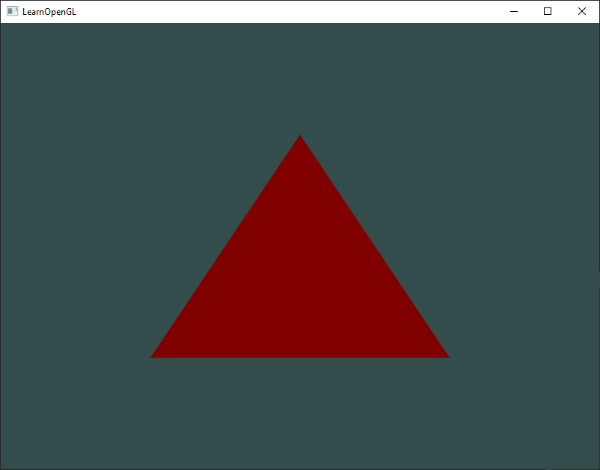

# Shader

앞서 "Hello Triangle" 장에서 언급한 바와 같이, 셰이더는 GPU에 위치한 작은 프로그램들입니다. 이 프로그램들은 그래픽 파이프라인의 각 특정 구간에서 실행됩니다. 기본적으로 셰이더는 입력을 출력으로 변환하는 프로그램에 불과합니다. 셰이더는 또한 서로 통신할 수 없는 매우 독립적인 프로그램입니다. 셰이더 간의 유일한 통신은 입력과 출력을 통해 이루어집니다.

이전 장에서는 셰이더와 그 올바른 사용 방법에 대해 간단히 다뤘습니다. 이제는 셰이더, 특히 OpenGL 셰이딩 언어(GLSL)에 대해 더 일반적인 방식으로 설명하겠습니다.

## GLSL

셰이더는 C와 유사한 언어인 GLSL로 작성됩니다. GLSL은 그래픽 작업에 특화되어 있으며, 벡터와 행렬 조작을 위해 특별히 설계된 유용한 기능들을 제공합니다.

셰이더는 항상 버전 선언으로 시작하며, 그 다음에 입력 및 출력 변수, 유니폼, 그리고 메인 함수가 나옵니다. 각 셰이더의 진입점은 메인 함수로, 이곳에서 입력 변수를 처리하고 그 결과를 출력 변수에 출력합니다. 유니폼이 무엇인지 모른다고 걱정하지 마세요, 곧 그 부분을 다룰 것입니다.

셰이더는 일반적으로 다음과 같은 구조를 가집니다:

```GLSL
#version version_number
in type in_variable_name;
in type in_variable_name;

out type out_variable_name;
  
uniform type uniform_name;
  
void main()
{
  // process input(s) and do some weird graphics stuff
  ...
  // output processed stuff to output variable
  out_variable_name = weird_stuff_we_processed;
}
```

정점 셰이더에 대해 구체적으로 말할 때, 각 입력 변수는 '정점 속성'이라고도 불립니다. 정점 속성은 하드웨어에 의해 선언할 수 있는 최대 수가 제한되어 있습니다. OpenGL은 항상 적어도 16개의 4-component 정점 속성을 사용할 수 있도록 보장하지만, 일부 하드웨어는 더 많은 속성을 허용할 수 있습니다. 이를 `GL_MAX_VERTEX_ATTRIBS`를 통해 조회할 수 있습니다.

```C++
int nrAttributes;
glGetIntegerv(GL_MAX_VERTEX_ATTRIBS, &nrAttributes);
std::cout << "Maximum nr of vertex attributes supported: " << nrAttributes << std::endl;
```

이 값은 종종 16이라는 최소값을 반환하는데, 이는 대부분의 용도에는 충분히 적합합니다.

## Types

GLSL은 다른 프로그래밍 언어들처럼 우리가 작업할 변수의 유형을 지정하기 위한 데이터 타입을 가지고 있습니다. GLSL은 C와 같은 언어에서 흔히 사용하는 기본 타입들인 int, float, double, uint, bool을 대부분 지원합니다. GLSL은 또한 우리가 자주 사용할 두 가지 컨테이너 타입인 벡터와 행렬을 제공합니다. 행렬에 대해서는 나중 장에서 다룰 예정입니다.

### Vectors

GLSL에서 벡터는 앞서 언급한 기본 타입을 담을 수 있는 2, 3 또는 4개의 컴포넌트로 구성된 컨테이너입니다. 벡터는 다음과 같은 형태를 가질 수 있습니다 (n은 컴포넌트 수를 나타냅니다):

- vecn: n개의 float로 이루어진 기본 벡터.
- bvecn: n개의 boolean으로 이루어진 벡터.
- ivecn: n개의 integer로 이루어진 벡터.
- uvecn: n개의 unsigned integer로 이루어진 벡터.
- dvecn: n개의 double로 이루어진 벡터.

대부분의 경우, 우리는 vecn을 사용합니다. 왜냐하면 float가 대부분의 용도에 충분하기 때문입니다.

벡터의 컴포넌트는 vec.x와 같이 접근할 수 있습니다. 여기서 x는 벡터의 첫 번째 컴포넌트를 나타냅니다. .x, .y, .z, .w를 사용하여 각각 첫 번째, 두 번째, 세 번째, 네 번째 컴포넌트에 접근할 수 있습니다. GLSL은 색상에 대해서는 rgba를, 텍스처 좌표에 대해서는 stpq를 사용할 수 있도록 하여 동일한 컴포넌트에 접근할 수 있게 합니다.

벡터 데이터 타입은 흥미롭고 유연한 컴포넌트 선택을 가능하게 하는 '스위즐링(swizzling)'을 지원합니다. 스위즐링은 다음과 같은 구문을 사용할 수 있게 합니다:

```C++
vec2 someVec;
vec4 differentVec = someVec.xyxx;
vec3 anotherVec = differentVec.zyw;
vec4 otherVec = someVec.xxxx + anotherVec.yxzy;
```

벡터는 최대 4개의 문자로 조합하여 새로운 벡터(동일한 타입)로 만들 수 있습니다. 다만 원래 벡터가 해당 컴포넌트를 갖고 있어야 하며, 예를 들어 vec2에서 .z 컴포넌트에 접근하는 것은 허용되지 않습니다. 또한, 벡터를 다른 벡터 생성자 호출의 인수로 전달할 수 있어 필요한 인수의 수를 줄일 수 있습니다:

```C++
vec2 vect = vec2(0.5, 0.7);
vec4 result = vec4(vect, 0.0, 0.0);
vec4 otherResult = vec4(result.xyz, 1.0);
```

벡터는 이처럼 입력과 출력에 대해 매우 유연하게 사용할 수 있는 데이터 타입입니다. 책 전반에 걸쳐 벡터를 창의적으로 관리하는 여러 예시를 볼 수 있을 것입니다.

## Ins and outs

셰이더는 자체적으로 훌륭한 작은 프로그램이지만, 전체적인 구조의 일환으로서 작동하므로, 우리는 셰이더의 입력과 출력을 설정하여 데이터를 전달할 수 있게 합니다. 이를 위해 GLSL에서는 in과 out 키워드를 정의했습니다. 각 셰이더는 이 키워드를 사용하여 입력과 출력을 명시할 수 있으며, 출력 변수가 다음 셰이더 단계의 입력 변수와 일치하면 해당 값이 전달됩니다. 다만, 정점 셰이더와 프래그먼트 셰이더는 약간 다릅니다.

정점 셰이더는 입력을 받아야 효과적으로 작동할 수 있기 때문에 반드시 입력이 필요합니다. 정점 셰이더는 그 입력을 정점 데이터에서 직접 받습니다. 정점 데이터가 어떻게 구성되는지 정의하기 위해, 우리는 `layout(location = 0)`과 같은 형식으로 입력 변수에 위치 메타데이터를 지정하여 CPU에서 정점 속성을 설정할 수 있습니다. 이 부분은 이전 장에서 이미 살펴본 내용입니다. 따라서 정점 셰이더는 입력을 연결하기 위해 추가적인 레이아웃 명시가 필요합니다.

> `layout(location = 0)` 지정자를 생략하고 OpenGL 코드에서 `glGetAttribLocation`을 사용하여 속성 위치를 쿼리할 수도 있지만, 저는 정점 셰이더에서 직접 설정하는 것을 선호합니다. 이렇게 하는 것이 이해하기 더 쉽고, (당신과 OpenGL에게) 더 효율적이기 때문입니다.

또 다른 예외는 프래그먼트 셰이더가 vec4 타입의 색상 출력 변수를 필요로 한다는 것입니다. 프래그먼트 셰이더는 최종 출력 색상을 생성해야 하기 때문입니다. 만약 프래그먼트 셰이더에서 출력 색상을 명시하지 않으면, 해당 프래그먼트들의 색상 버퍼 출력은 정의되지 않으며 (보통 OpenGL은 이를 검정색 또는 흰색으로 렌더링합니다).

따라서 한 셰이더에서 다른 셰이더로 데이터를 전송하려면, 보내는 셰이더에서 출력 변수를 선언하고 받는 셰이더에서 유사한 입력 변수를 선언해야 합니다. 두 쪽에서 타입과 이름이 같으면, OpenGL은 이 변수를 연결하여 셰이더 간에 데이터를 전달할 수 있게 됩니다 (이것은 프로그램 객체를 링크할 때 이루어집니다). 이 과정이 실제로 어떻게 작동하는지 보여주기 위해, 우리는 이전 장에서 사용했던 셰이더를 수정하여 정점 셰이더가 프래그먼트 셰이더의 색상을 결정하도록 할 것입니다.

### Vertex shader

```GLSL
#version 330 core
layout (location = 0) in vec3 aPos; // the position variable has attribute position 0
  
out vec4 vertexColor; // specify a color output to the fragment shader

void main()
{
    gl_Position = vec4(aPos, 1.0); // see how we directly give a vec3 to vec4's constructor
    vertexColor = vec4(0.5, 0.0, 0.0, 1.0); // set the output variable to a dark-red color
}
```

### Fragment shader

```GLSL
#version 330 core
out vec4 FragColor;
  
in vec4 vertexColor; // the input variable from the vertex shader (same name and same type)  

void main()
{
    FragColor = vertexColor;
} 
```

우리는 vertexColor 변수를 vec4 타입의 출력 변수로 선언하고, 이를 정점 셰이더에서 설정한 후, 프래그먼트 셰이더에서 유사한 vertexColor 입력 변수를 선언했습니다. 두 변수의 타입과 이름이 같기 때문에, 프래그먼트 셰이더의 vertexColor는 정점 셰이더의 vertexColor와 연결됩니다. 우리가 정점 셰이더에서 색상을 어두운 빨간색으로 설정했으므로, 그 결과로 생성된 프래그먼트들도 어두운 빨간색이어야 합니다. 다음 이미지는 그 출력 결과를 보여줍니다:



이제 성공적으로 정점 셰이더에서 프래그먼트 셰이더로 값을 전달할 수 있었습니다! 이제 조금 더 재미있게 만들고, 우리의 애플리케이션에서 색상을 프래그먼트 셰이더로 전달할 수 있는지 확인해봅시다!

## Uniforms

